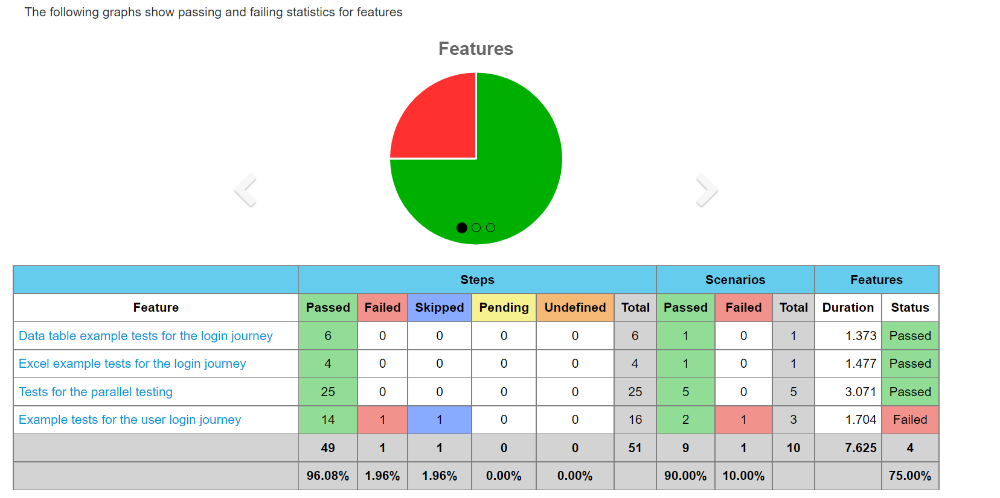
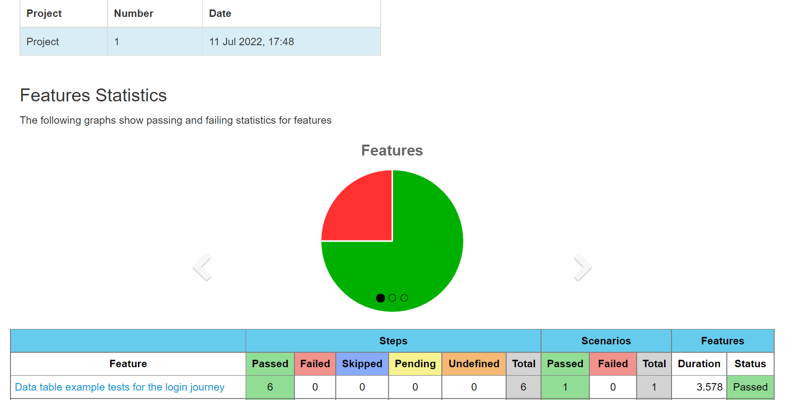
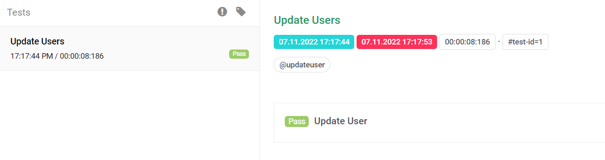
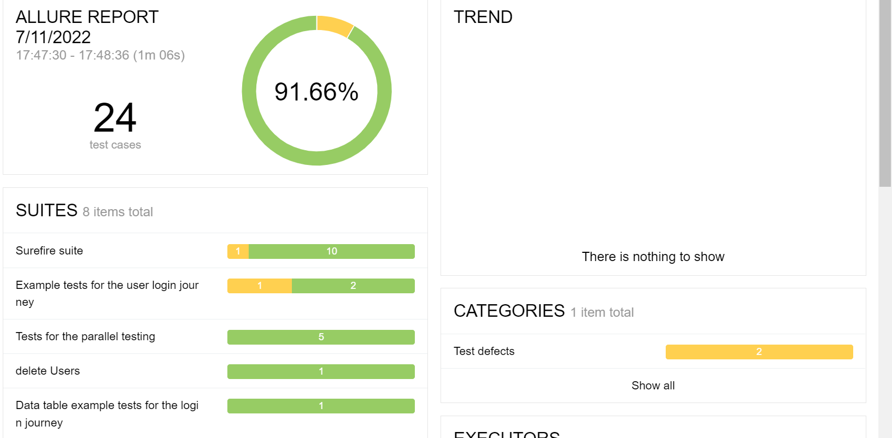

<!-- TABLE OF CONTENTS V -->
<details open="open">
  <summary>Table of Contents</summary>
  <ol>
    <li>
      <a href="#ABOUT THE PROJECT">TestX-Mobile-Appium-RestAssured</a>
      <ul>
        <li><a href="accelerator-features">Accelerator features</a></li>
      </ul>
    </li>
    <li>
      <a href="built-with">Built with</a>
    </li>
    <li>
      <a href="#getting-started">Getting Started</a>
      	<ul>
        		<li><a href="prerequisites">Prerequisites</a></li> 
        		<li><a href="installation">Installation</a></li>       
        </ul>
    </li>
    <li>
    <a href="usage">Usage</a>
        <ul>
            <li><a href="writing-a-test">Writing a test</a></li>
            <li><a href="sample-feature-file-to-understand-the-keywords"> Understanding the keywords</a></li>
            <li><a href="#key-words-used-in-cucumber-feature-files">Key Words used in Cucumber feature files</a></li>
             <li><a href="#configuration">Config Information</a></li>           
             <li><a href="#running-tests">Running tests</a></li>
            <li><a href="#test-reports">Test reports</a>
                <ul>
                <li><a href="#default-cucumber-report">Default Cucumber report</a>
                <li><a href="#extent-cucumber-report">Extent Cucumber Report</a>
                <li><a href="#allure-reporting">Allure reporting</a>
                </ul>
            </li>
        </ul>
    </li>
    <li><a href="#faq">FAQs</a></li>
    <li><a href="#contributing">Contributing</a></li>
    <li><a href="#contact">Contact</a></li>
  </ol>
</details>

<!-- ABOUT THE PROJECT -->
### **TestX-Mobile-Appium-RestAssured**
### **UI Framework**
This accelerator is an UI functional automation testing tool used to perform the UI Functional testing and API functional automation testing tool used to perform the functional testing of API's based on RestFull service.
Automated UI testing refers to the usage of specific tools or frameworks for automating the manual test processes that verify UI functionality.
### **Accelerator features:**
- Tests UI Functionality: With the help of this framework we are able to test UI functionality of web as well as Mobile based applications.
- Common methods: In this framework we have implemented common methods concept,with the help of this method at run time it will pick up page and WebElements.
- Predefined assertions: In this file all our assertion steps is present (src/test/java/com/testx/mobile/appium/selenium/restassured/qe/ui/stepdefinitions/prebuilt_steps)
- Prebuilt DB steps: In this file our DB connection steps is present
- Prebuilt browser steps: In this file all browser related steps present
- Generating test reports: We able to generate 2 types of report.
- Parallel execution: Parallel execution is also possible using this framework. Parallel execution is not supported in Mobile as of now.


### **Built with**
* **Selenium** - for testing the UI https://www.selenium.dev/
* **Cucumber** - for BDD approach https://cucumber.io/
* **Maven** - build management tool https://maven.apache.org/
* **Testng** - for assertion https://testng.org/doc/
* **ExtentCucumberReport** - for reporting the test results we add dependency
* **Appium** - for mobile automation - [Appium.](https://appium.io/)


### **Getting Started**

Follow these instructions to get a UI  accelerator up and running and testing on your local machine.

### **Prerequisites**

- JDK 8 or higher version
- Maven
- Cucumber plugin
- IDE (IntelliJ or Eclipse with Cucumber Plugin)
- Node
- Appium Server installed using NPM
- Android Studios - Android Automation
- Xcode - iOS Automation

### **Installation**

- Install Java and set path.
- Install Maven and set path.
- Clone the repository using git.
    - git clone \<url\>
- Install Node and Install appium using following command
    - npm install -g appium
- Install Android studios for Android automation and set the Android home paths.
- Install Xcode for iOS automation.
- Install appium inspector for element inspection.


<!-- USAGE EXAMPLES -->
### **Usage**

This accelerator is specifically designed to perform functional testing for UI of web based applications and to perform functional testing REST  API's::


1. Perform functional test for given application.
2. Provide sample test to start the the UI functional testing on Web and mobile device.

### **Writing a test**

* The test case (cucumber feature file) goes in the `features` library and should have the ".feature" extension.

* You can start writing test using reference at `src/test/resources/ui/features/sample.feature`. You can extend this feature or make your own features using some of the predefined cucumber steps.

### ** Common Methods Implementation of this framework:**
1. Common methods:
  ```
public WebElement loadWebElement(String elementName, String pageClassName) {
   return loadAndFindPageElement(elementName, pageClassName);
   }

   private WebElement loadAndFindPageElement(String locatorName, String pageClassName) {
   WebElement element = null;
   Class<?> loadClass = null;
   try {
   loadClass = Class.forName(UI_PAGE_OBJECTS_PACKAGE + pageClassName);
   } catch (ClassNotFoundException e) {
   e.printStackTrace();
   }
   PageFactory.initElements(driver, loadClass);
   Field field = null;
   try {
   field = loadClass.getDeclaredField(locatorName);
   } catch (NoSuchFieldException e) {
   e.printStackTrace();
   }
   try {
   element = (WebElement) field.get(null);
   } catch (IllegalAccessException e) {
   e.printStackTrace();
   }
   return element;
   }
   }

```
### **Project Structure**:

1. #### **SRC>MAIN>JAVA>UI**
- **config**: In this  we are maintaining all the variables name
###### Example:
```
@LoadPolicy(LoadType.MERGE)
@Config.Sources({
        "system:properties",
        "classpath:general.properties",
        "classpath:db.properties",
        "classpath:grid.properties"})
public interface Configuration extends Config {

    @Key("baseurl")
    String baseUrl();
```
here baseurl is our variable name and baseUrl() is a method which is configured in allure manager class.

- **context**: In this  driver manager object is present.

- **custom_exceptions**: In this  our own exceptions is present.
- **reporter**: In this our allure manager is present where we put all our methods which we mention in config class.
- **webdriver**: In this we maintain our drivermanager ,driver manager utils,selectwebdriver factory and webdriver factory class.
- **capbilities**: In this we maintain mobile capabilities such as desired capabilities.


2. #### **SRC>MAIN>RESOURCES:**
- **config.properties**:Here we mention our baseurl,browsername in below format.
###### Example:
   ```
 baseurl=https://www.saucedemo.com/
 browsername=chrome
 isheadless=false
```
- **general.properties:Here we specify below details.**
###### Example:

   ```
target = local
url.base = https://www.saucedemo.com/
timeout = 3
faker.locale = pt-BR
browser = chrome
headless = true
```


3. #### SRC>TEST>JAVA>UI
a. **pageobjects**-Here we are putting all page class.

###### Example: SamplePage ,here we are putting our xpath for datepicker element which can be picked at run time using common methods. We can implement Web as well as Mobile pages in this class.

```
public class SamplePage extends AbstractPageObject {

    protected SamplePage(TestContext testContext) {
        super(testContext);
    }

    @FindBy(id = "datePickerMonthYearInput")
    public static WebElement datePickerInput;
}

```
b. **stepdefinations**:In this folder we specify all our prebuilt steps like BaseSetup, Hooks, LoginSteps.
###### Example:  In this class all required login steps is present.
```
public class SamplePage extends AbstractPageObject {

    protected SamplePage(TestContext testContext) {
        super(testContext);
    }

    @FindBy(id = "datePickerMonthYearInput")
    public static WebElement datePickerInput;
}

```

c. **testrunners**: With the help of this class we are able to run our test.In this class we specify our feature file path,step def file,report plugin.
```
@Test
@CucumberOptions
        (plugin = {"io.qameta.allure.cucumber6jvm.AllureCucumber6Jvm","pretty", "html:target/cucumber-report/report.html",
                "com.aventstack.extentreports.cucumber.adapter.ExtentCucumberAdapter:"
                ,"json:target/cucumber-report/cucumber.json","pretty","html:target/cucumber-report/cucumber-pretty",
                "json:target/cucumber-report/CucumberTestReport.json"},
                monochrome = true,
                features = "src/test/resources/ui/features",
                glue = {"com.testx.mobile.appium.selenium.restassured.qe.ui.stepdefinitions"},
                tags = "@sample")

```

#### 4. ****SRC>TEST>RESOURCES****

**a. App:** In app folder we keep test app i.e. Android - .apk file and IOS - .ipa file.
**b. Config:** In config folder we keep all desired capabilities json file and environments yaml file.
###### Example: desired capabilities ..
```
{

"android": {
"app": "/src/test/resources/app/Android.SauceLabs.Mobile.Sample.app.2.7.1.apk",
"url": "http://0.0.0.0:4723/wd/hub",
"appActivity": "com.swaglabsmobileapp.MainActivity",
"devices": [
{
"deviceName": "emulator-5554",
"automationName": "UIAutomator2",
"noReset": "True",
"model": "sdkgphone64_x86_64",
"browserName": "Chrome",
"os_version": "10.0"
},
{
"build": 2,
"deviceName": "emulator-5554",
"automationName": "UIAutomator2",
"noReset": "True",
"model": "Pixel_6_Pro_API_33",
"browserName": "Chrome",
"os_version": "12.0"
}
],
"cloudDevices": [
{
"_comments": "this object is for Perfecto",
"deviceName": "RFCN104SV7B"
},
{
"_comments": "this object is for BrowserStack",
"deviceName": "Samsung Galaxy S22 Ultra",
"os_version": "12.0"
}
]
},
"ios": {
"app": "/src/test/resources/app/iOS.Simulator.SauceLabs.Mobile.Sample.app",
"url": "http://0.0.0.0:4723/wd/hub",
"devices": [
{
"build": 1,
"deviceName": "iPhone 13",
"automationName": "XCUITest",
"noReset": "True",
"iOSResign": "True",
"browserName": "Safari",
"os_version": "15.4"
}
],
"cloudDevices": [
{
"_comments": "this object is for Perfecto",
"deviceName": "B4440E47938CA104E88F34C659CD9A4EBF991268"
},
{
"_comments": "this object is for BrowserStack",
"deviceName": "iPhone 14 Pro Max",
"os_version": "16.0"
}
]
},
"cloud": {
"perfecto": {
"url": ".perfectomobile.com/nexperience/perfectomobile/wd/hub",
"repositoryUrl": ".app.perfectomobile.com/repository/api/v1/artifacts",
"cloudName": "trial",
"securityToken": ""
},
"browserStack": {
"url": "@hub-cloud.browserstack.com/wd/hub",
"user": "",
"key": "",
"baseUrl": "https://api-cloud.browserstack.com/app-automate/upload"
}
}
}
```

**c. UI>excel_data:** In excel_data we put our TestData file ,in this file we put our reusable data and fetch this data from feature file.
**d. UI>features:** Here we put our all feature files
###### Example1:
###### Feature: Data table example tests for the login journey

###### In this example we're validating user login functionality with valid credential and fetching data from database table.

```
@sample
Feature: Data table example tests for the login journey

  Scenario: As a registered user, user should be able to logged in
    Given I am in App main site
    And I enter the data for the following fields on the "LoginPage"
      | fieldName     | data          |
      | usernameInput | standard_user |
      | passwordInput | secret_sauce  |
    When I click the following elements on the "LoginPage"
      | fieldName   |
      | loginButton |
    And I verify the text of the following fields on the "HomePage"
      | fieldName    | fieldText |
      | productsMain | PRODUCTS  |

    Then I verify that the text: "Swag" partially matches the current page title
    And I verify that the text: "Swag Labs" exactly matches the current page title
```
###### **Example2**
###### **Feature: Excel example tests for the login journey**

###### **In this example we're validating user login functionality with valid credential and fetching data from testdata .**

```
@sample
Feature: Excel example tests for the login journey

  Scenario: Login to the application using excel data
    Given I am in App main site
    When I enter the data for the following fields from the excel file TestData:LoginPage:TID1
      | FieldName     | PageName  |
      | usernameInput | LoginPage |
      | passwordInput | LoginPage |
    When I click the "loginButton" on the "LoginPage"
    And I verify that the text: "Swag Labs" exactly matches the current page title

```
###### Example3:
###### Feature: Tests for the parallel testing

###### In this example we're running parallel test.

```
@sample
Feature: Tests for the parallel testing

  Scenario: Parallel test 1
    Given I am in App main site
    And I enter the value "standard_user" into the "usernameInput" on the "LoginPage"
    And I enter the value "secret_sauce" into the "passwordInput" on the "LoginPage"
    When I click the "loginButton" on the "LoginPage"
    And I verify that the text: "Swag Labs" exactly matches the current page title

  Scenario: Parallel test 2
    Given I am in App main site
    And I enter the value "standard_user" into the "usernameInput" on the "LoginPage"
    And I enter the value "secret_sauce" into the "passwordInput" on the "LoginPage"
    When I click the "loginButton" on the "LoginPage"
    And I verify that the text: "Swag Labs" exactly matches the current page title

```
###### Example4:
###### Feature: Example tests for the user login journey

###### This is the generic way of writing feature file .
```
@sample
Feature: Example tests for the user login journey

  Scenario: As a registered user, user should be able to logged in
    Given I am in App main site
    And I enter the value "standard_user" into the "usernameInput" on the "LoginPage"
    And I enter the value "secret_sauce" into the "passwordInput" on the "LoginPage"
    When I click the "loginButton" on the "LoginPage"
    And I verify that the text: "Swag Labs" exactly matches the current page title
```

###### Example5:
###### Feature: Example tests for the user login journey for mobile

###### This is the generic way of writing feature file .
```
@sampleMobile
Feature: Example tests for the user login journey for Mobile

  Scenario: As a registered user, user should be able to logged in to mobile
    Given I am in App main site
    And I enter the value "standard_user" into the "usernameInput" on the "LoginPageMobile"
    And I enter the value "secret_sauce" into the "passwordInput" on the "LoginPageMobile"
    When I click the "loginButton" on the "LoginPageMobile"
    And I verify that the text: "Swag Labs" exactly matches the current page title
```

**e. general.properties:Here we specify below detailsfor **
###### Example:

   ```
# target execution: local or remote
target = local

# initial URL
url.base = https://www.saucedemo.com/

# global test timeout
timeout = 3

# javafaker locale
faker.locale = pt-BR

#this property is for the web
browser = chrome

# cloud accept perfecto, browserStack
cloudPlatform = browserStack

# headless mode only for web chrome or firefox and local execution
headless = true

# platform expects values only web or mobile 
platform = mobile

# isMobileWeb expects values only true/false if true it will launch in  app if false it will launch in web 
isMobileWeb = false

# mobile.platform expects values only android/ios
mobile.platform = ios


Note: Begore running test case via runner you need to made changes in general properties file as per own testing mobile,web,android or ios.
```

**f. desired_capabilities.json: Here we specify the capabilities Android & iOS for local and cloud execution.**

#### below is the path for the desired_capabilities.json and we need to update the cloudName, securityToken for Perfecto and user, Key for BrowserStack
```   
src/test/resources/config/desired_capabilities.json
"cloud": {
    "perfecto": {
      "url": ".perfectomobile.com/nexperience/perfectomobile/wd/hub",
      "repositoryUrl": ".app.perfectomobile.com/repository/api/v1/artifacts",
      "cloudName": "",
      "securityToken": ""
    },
    "browserStack": {
      "url": "@hub-cloud.browserstack.com/wd/hub",
      "user": "",
      "key": "",
      "baseUrl": "https://api-cloud.browserstack.com/app-automate/upload"
    }
  }
```

#### Key Words used in Cucumber feature files

- Feature (A suitable name for your scenarios in the feature file)
- Scenario (A suitable name for the scenario you are trying to write)
- Given, When, Then, And, But (step keywords to describe the flow)
  .- Examples (Using Scenario and Examples, scenario can be repeated with multiple values from Examples table)
- | (Data Tables) - Data Tables can be used to pass multiple values in the same step
- @ (Tags) - Particular scenario/feature can be executed by running with tags.
- '#' can be used to provide Comments
  Cucumber Tutorials: https://docs.cucumber.io/guides/10-minute-tutorial/

### Running tests :

There are two ways to run the test from this project

1. RunCucumberTest java file at location **src/test/java/com/testx/mobile/appium/selenium/restassured/qe/ui/testrunners/RunUITest.java**
    1. You can provide the test tag information in Runner file and Run the Test using Java File


2. Using command line: Go to your project directory from terminal and execute following commands
    * mvn clean install -Dtest=RunUITest.java

### Running Parallel tests :
1. RunCucumberTest java file at location **src/test/java/com/testx/mobile/appium/selenium/restassured/qe/ui/testrunners/RunUIParallelTest.java**
    1. You can provide the test tag information in Runner file and Run the Test using Java File


2. Using command line: Go to your project directory from terminal and execute following commands
    * mvn clean -Dtest=RunUIParallelTest -Ddataproviderthreadcount=3 test

**Note:** We need to install android studios for Android automation and connect device with system before executing the android scripts. 


### Test reports
This accelerator supports test reporting using default cucumber reports ,allure report and cucumber extent report

### Default Cucumber report

For cucumber default report implementation below are the pre-requisite:
1. Add below plugin  in pom.xml
#### plugin
```
<plugin>
        <groupId>net.masterthought</groupId>
        <artifactId>maven-cucumber-reporting</artifactId>
        <version>4.4.0</version>
        <executions>
          <execution>
            <id>execution</id>
            <phase>verify</phase>
            <goals>
              <goal>generate</goal>
            </goals>
            <configuration>
              <projectName>Project</projectName>
              <outputDirectory>${project.build.directory}</outputDirectory>
              <inputDirectory>${project.build.directory}</inputDirectory>
              <jsonFiles>
                <param>**/cucumber*.json</param>
              </jsonFiles>
            </configuration>
          </execution>
        </executions>
      </plugin>
```

2. Add below dependency in pom.xml
#### dependency
```
 <dependency>
      <groupId>net.masterthought</groupId>
      <artifactId>cucumber-reporting</artifactId>
      <version>${cucumberreporting.version}</version>
    </dependency>
```

3. In pom.xml file make testfailure=true
#### testfailure=true
```
 <testFailureIgnore>true</testFailureIgnore>
```

4. Add plugin in runner file in below format:
#### format
```
 "json:target/cucumber-report/CucumberTestReport.json"
```

5. Run below command through terminal
#### command
```
   mvn clean -Dtest=RunUITest
     mvn clean -Dtest=RunUIParallelTest
```

You can find the basic Cucumber report under **target/cucumber-html-reports/overview-features.html**

```
   mvn clean -Dtest=RunUITest
     mvn clean -Dtest=RunUIParallelTest
```


#### Cucumber extent Report
You can find the report after the Tests Execution
For cucumber extent report implementation below are the pre-requisite:
1. Add dependency in pom extentreports and extentreports-cucumber6-adapter.
2. Add plugin in runner file "com.aventstack.extentreports.cucumber.adapter.ExtentCucumberAdapter:"

* directory for Cucumber extent report in the current project, **target/cucumber/myextentreport.html**


#### Allure reporting
This accelerator also integrates with the Allure reporting framework. You can find the report after the Tests Execution
* directory for Allure report in the current project, **build/reports/allure-report/index.html** by default

#### We can generate allure report through terminal only by using below command:
```
    mvn allure:serve
```


### FAQs
**Q:** Does this Accelerator Support all ParallelUI run

**A:** Yes, We can run test in parallel**

##
**Q:** Does this Accelerator has Ability to pick elements and pages dynamically at run time.
**A:** Yes, this Accelerator has Ability to pick elements and pages dynamically at run time**

##

**Q:** Does this Accelerator has In-built Test Reporting

**A:** Yes, This Accelerator Support Default Cucumber Reporting as well As Cucumber Extent Report.

##


----------------
----
----
<!-- ABOUT THE PROJECT -->
### **TestX-Mobile-Appium-RestAssured**
### **Rest-Assured API Framework**

This accelerator is an API functional automation testing tool used to perform the functional testing of API's based on RestFull Service.

API testing is a software testing practice that tests the APIs directly — from their functionality, reliability and performance, to security. API testing effectively validates the logic of the build architecture in a short amount of time.


### **Accelerator features**
- Tests  REST  calls
- Predefined test steps
- Predefined assertions
- Soft assertion
- Generating test reports
- Jenkins pipeline integration
- Environment agnostic
- Parallel execution

### **Built with**
* **RESTAssured** - for testing the API services https://rest-assured.io/
* **Cucumber** - for BDD approach https://cucumber.io/
* **Gradle** - build management tool https://gradle.org/
* **Hamcrest** - for asserting the API responses http://hamcrest.org/JavaHamcrest/tutorial
* **Allure** - for reporting the test results https://docs.qameta.io/allure/


### **Getting Started**

Follow these instructions to get a  accelerator up and running and testing on your local machine.

### **Prerequisites**

- JDK 8 or higher version
- Gradle 6.1+
- IDE (IntelliJ or Eclipse with Cucumber Plugin)

### **Installation**

- Install Java and set path.
- Install Gradle and set path.
- Clone the repository using git.
    - git clone <url>

### **Mandatory prerequisite for writing feature file**

- Specify test environment which will choose at run time in configconstants(src/main/java/com/testx/mobile/appium/selenium/restassured/qe/api/constants/ConfigConstants.java)
- Specify Base_Path in request.json(src/test/resources/api/api_data/qaenv/create_user/request.json)
- Specify end point in request.json

<!-- USAGE EXAMPLES -->
### **Usage**

This accelerator is specifically designed to perform functional testing REST or SOAP API's:


1. Perform functional test for given application.
2. Provide sample test to start the the API functional testing.

### **Writing a test**

* The test case (cucumber feature file) goes in the `features` library and should have the ".feature" extension.

* You can start writing test using reference at `src/test/resources/api/features/createuser.feature`. You can extend this feature or make your own features using some of the predefined cucumber steps.

### **Project Structure:**
.
1. **SRC>MAIN>JAVA>API**:
- **constants**: In this we have a interface  where we are maintaining all the variables name

###### Example:
```
@LoadPolicy(LoadType.MERGE)
public interface ConfigConstants {

    String BASE_URI = "host_uri";
    String GZIP_SUPPORT = "gzip_support";
    String FOLLOW_REDIRECTS = "follow_redirects";
```
- **custom_exceptions:** In this  our own exceptions is present.
- **httpoperations:** In this we have Httpoperations where all required hhtp method is configured .
###### Example:
```
GET, POST, PUT, DELETE, OPTIONS, HEAD, PATCH;

    public static HttpOperations parse(String apiRequest){
        for(HttpOperations httpMethod : values()) {
            if(httpMethod.toString().equalsIgnoreCase(apiRequest))
                return httpMethod;
        }
        throw  new IllegalArgumentException();
    }

    public Response doRequest(RequestSpecification when, String url) {
        switch (this) {
            case GET: return when.get(url);
            case POST: return when.post(url);
            case PUT: return when.put(url);
            case DELETE: return when.delete(url);
            case OPTIONS: return when.options(url);
            case HEAD: return when.head(url);
            case PATCH: return when.patch(url);
        }
        throw new CustomException("The given http method: " + url + "is not valid.");
    }
```
and we have httpCertTrust and wait conditions file in this folder.
- **httpservicemanager:** In this we have RestRequestManager ,Api response matcher,config Manager,httprequestmanager,httpservice assertion,restserviceconfigmanager.

#### 2.**SRC>TEST>JAVA>API**

**a.constants:** Here we are putting entity,filepath and header class.In filepath we specify path of all files.
###### Example:
```
 public static final String API_PATH_REQUEST_JSON =
   "/api/api_data/env_type/api_path/request.json";

public static final String TEST_DATA_FILE_PATH = "api/api_data/env_type/api_path/test_data.yml";

```
**b. enums:** In this we have api context file where we specify all required enums in below format:
## eg:
 ```
   public enum ApiContext {
     API_NAME,
     ID,
     BASE_PATH,
     REQUEST_BODY,
     RESPONSE_BODY,
     ACCESS_TOKEN,
     BRAND_HEADER,
     INITIAL_RESPONSE_BODY,
     }
```
**c. runners:** With the help of this class we are able to run our test.In this class we specify our feature file path,step def file,report plugin.

###### Examples:

 ```
@Test
@CucumberOptions
        (plugin = {"io.qameta.allure.cucumber6jvm.AllureCucumber6Jvm","pretty", "html:target/cucumber-report/report.html",
                "com.aventstack.extentreports.cucumber.adapter.ExtentCucumberAdapter:"
                ,"json:target/cucumber-report/cucumber.json","pretty","html:target/cucumber-report/cucumber-pretty",
                "json:target/cucumber-report/CucumberTestReport.json"},
                monochrome = true,
                features = "src/test/resources/api/features",
                glue = {"com.testx.mobile.appium.selenium.restassured.qe.api.stepdefs"},
                tags = "@updateuser")

```

**d.stepdefs:** In this folder we specify all our prebuilt steps like CommonGivenTestSteps,CommonThenTestSteps,CommonWhenTestSteps,Hooks,TestManagerContext,TestScenarioContext.

###### Example:  In this class all required given steps is present .
 ```
public class CommonGivenTestSteps {

  public RestRequestManager restRequestManager;
  TestManagerContext testManagerContext;

  public CommonGivenTestSteps(TestManagerContext context) {
  testManagerContext = context;
  restRequestManager = testManagerContext.getRestRequest();
  }

  @Given("I have API {string}")
  public void iHaveAPI(String apiName) throws IOException, URISyntaxException {
  testManagerContext.getScenarioContext().setContext(ApiContext.API_NAME, apiName);
  ApiUtilManager apiUtilManager = new ApiUtilManager();
  String basePath = apiUtilManager.getBasePath((String) testManagerContext.getScenarioContext().getContext(ApiContext.API_NAME));
  testManagerContext.getScenarioContext().setContext(ApiContext.BASE_PATH, basePath);
  apiUtilManager.setEntityHostURI(apiName, testManagerContext);
  restRequestManager.clearRequestBody();
  }

```  

**e. util:** In this folder we put our Apiutilmanager which contains configurations of env ,logger etc.

#### **4.SRC>TEST>RESOURCES:**
**a. API>api_data:**
- **devenv.jsonplaceholder**  ,in this folder we put our request.json,request_response-mapping.yml,testdata.yml.
##### request.json:

 ```
{
    "base_path": "https://reqres.in/api/users/2",
  "header": {
    "Content-Type": "application/json"
  },
  "request": {
    "name": "get single user"
  }
  }

```
#### request_response_mapping.yml:
```
 CreateUser:
  'name': 'name'

```
#### testdata.yml:
```
 User1:
  name: 'microservice_test_accelerator'

  User2:
  name: 'microservice_test_accelerator1'
```

- **qaenv:** Here we specify files for qa env in below format:
###### Example: We have api for create_user,so under create_user folder we put our expected_response.json,request.json,response_data_mapping.yml,response_schema.json,test_data.yml
#### expected_response.json:
```
{
  "name": "morpheus",
  "job": "leader"

}

```
#### request.json:
```
{
"host_uri": "https://reqres.in",
"base_path": "{{context_path}}/users",
"header": {
"Content-Type": "application/json"
},
"request": {
"name": "create user"
}
}
```
#### response_data_mapping.yml:
```
CreateUsers:
'name': 'morpheus'
'job': 'leader'

```

#### response_schema.json:
```
{
"$schema": "http://json-schema.org/draft-04/schema#",
"type": "object",
"properties": {
"name": {
"type": "string"
},
"job": {
"type": "string"
},
"id": {
"type": "string"
},
"createdAt": {
"type": "string"
}
},
"required": [
"name",
"job",
"id",
"createdAt"
]
}
```
#### test_data.yml:
```
user_data:
{
"name": "morpheus",
"job": "leader"
}

```

**b. API>features:** Here we put our all feature files
###### Example1:
###### Feature: delete Users

###### In this example we're deleting user.
```
Feature: delete Users

@test1
Scenario Outline: Delete User
Given I have API "<API>"
When I call method 'DELETE'
Then I get the response
Then I verify response code is 204
Examples:
| API          |
| delete_users |
```

###### Example2
###### Feature: List Users

###### In this example we're fetching list of users .
```
@apitest
Scenario Outline: Get users Status
Given I have API "<API>"
And I set content-type as JSON
When I call method 'GET'
Then I get the response
Then I verify response code is "<Status_Code>"
Examples:
| API             | Status_Code |
| get_single_user | 200         |
| get_all_users   | 201         |
| user_not_found  | 404         |

```

###### Example3:
###### Feature: Create Users

###### In this example we're creating new resource.
```
Feature: Create Users

@apitest
Scenario Outline: Create user status codes
Given I have API "<API>"
And I set content-type as JSON
And I set request body for "<RequestBody>"
When I call method 'POST'
Then I get the response
Then I verify response code is "<Status_Code>"
Examples:
| API                   | RequestBody           | Status_Code |
| create_user           | user_data             | 201         |
| create_user_success   | registerdata          | 300         |
| create_user_unsuccess | register-unsuccesfull | 400         |

@apitest
Scenario Outline: users Response comparison
Given I have API "<API>"
And I set content-type as JSON
And I set request body for "<RequestBody>"
When I call method 'POST'
And I compare the expected response with the actual response with "<COMPARISON_MODE>"

    Examples:
      | API                   | RequestBody           | COMPARISON_MODE |
      | create_user           | user_data             | LENIENT         |
      | create_user_success   | registerdata          | LENIENT         |
      | create_user_unsuccess | register-unsuccesfull | LENIENT         |


```
###### Example4:
###### Feature: Update Users

###### In this example we are updating existing resource.
```
Feature: Update Users

@apitest  @updateuser
Scenario Outline: Update User
Given I have API "<API>"
And I set content-type as JSON
And I set request body for "<RequestBody>"
When I call method 'PUT'
Then I get the response
Then I verify response code is 200
And I verify the response schema
And I verify selected elements "UpdateUserAPISelectedElementsExpectedData" in response
And I compare the expected response with the actual response with "<COMPARISON_MODE>"

    Examples:
      | API          | RequestBody | COMPARISON_MODE |
      | update_users | updateUsers | LENIENT         |

```

### **Testing environment information**

This accelerator is environment agnostic. You can provide the environment information under **src/test/resources/config/envconfig.yml** file

```
commonconfigs:
   relaxed_https: 'true'
   url_encoding_enabled: 'true'
   max_timeout: '60'
   polling_time: '5'
 
qaenv:
   host_uri: 'https://jsonplaceholder.typicode.com'
   context_path: '/comments'
   follow_redirects: 'false'
   proxy: 'http://localhost:8080/'
 
devenv:
   host_uri: 'https://jsonplaceholder.typicode.com'
   context_path: '/comments'
   follow_redirects: 'false'
   proxy: 'http://localhost:8080/'`
```

### **API test information**

As mentioned in the sample, the accelerator file will know which API to test. We just need to provide the API information.

* **src/test/resources/apischema/env_name(devenv | qaenv)/jsonplaceholder**

    * **request.json** this file contains the api information
        * ```
          {
            "base_path": "{{context_path}}", --> context_path value will be picked from src/test/resources/config/envconfig.yml file
            "header": {
              "Content-Type": "application/json"  --> Default Header Values
            },
            "request": {
              "name": "microservice_test_accelerator" --> Actual API Schema
            }
          }
          ```
        * There is host and proxy configuration in the env file and for any API you want. Hit the API with a different host or disbale the proxy for that API to make this change request.json
           ```
          {
            "host_uri": "https://xyz.com", --> This will change the host call for this  APi
            "base_path": "{{context_path}}", --> context_path value will be picked from src/test/resources/config/envconfig.yml file
            "proxy_disabled": "true", --> This will disable the proxy configuration only for this API call
            "header": {
                "Content-Type": "application/json"  --> Default Header Values
            },
            "request": {
                "name": "microservice_test_accelerator" --> Actual API Schema
            }
          }
           ```

    * **request_response_mapping.yml** this file contains request key mapping information against the response and verification of the expected matching key  and actual value in test
        * ```
          CreateUser:
            'name': 'name'
          ```
    * **testdata.yml** this file contains the test data information to run an API test (feature file)
        * ```
          User1:
            name: 'microservice_test_accelerator'
          ```

### **Key Words used in Cucumber feature files**

- Feature (A suitable name for your scenarios in the feature file)
- Given, When, Then, And, But (step keywords to describe the flow)
- Background (Common step to run for all scenarios in that feature file)
- Scenario Outline
- Examples (Using Scenario Outline and Examples, scenario can be repeated with multiple values from Examples table)
- | (Data Tables) - Data Tables can be used to pass multiple values in the same step
- @ (Tags) - Particular scenario/feature can be executed by running with tags.
- '#' can be used to provide Comments
  Cucumber Tutorials: https://docs.cucumber.io/guides/10-minute-tutorial/

### **Running tests**

There are two ways to run the test from this project

1. RunCucumberTest java file at location **src/test/java/com/testx/mobile/appium/selenium/restassured/qe/api/runner/RunAPITest.java**
    - You can provide the test tag information in Runner file and Run the Test using Java File
    - By Default the Env name is Selected in file **src/main/java/com/microservice/test/accelerator/constants/ConfigConstants.java**
         ```
        String DEFAULT_ENV = "qaenv";
        ```

2. Using command line: Go to your project directory from terminal and execute following commands
    * mvn clean install -Dtest=RunAPITest.java
    * -Denv.type=<env_name> -Dtags=@<tag_name>` to run the specific tests on given env_name
    * -Denv.type=<env_name>` to run all the tests on given env

### **Running Parallel tests**:
1. RunCucumberTest java file at location **src/test/java/com/testx/mobile/appium/selenium/restassured/qe/api/runner/RunAPIParallelTest.java**
- You can provide the test tag information in Runner file and Run the Test using Java File
- By Default the Env name is Selected in file **src/main/java/com/testx/mobile/appium/selenium/restassured/qe/api/constants/ConfigConstants.java**
  ```
  String DEFAULT_ENV = "qaenv";
     ```

2. Using command line: Go to your project directory from terminal and execute following commands
    * mvn clean -Dtest=RunAPIParallelTest -Ddataproviderthreadcount=3 test
    * -Denv.type=<env_name> -Dtags=@<tag_name>` to run the specific tests on given env_name
    * -Denv.type=<env_name>` to run all the tests on given env


### **Test reports**
This accelerator supports test reporting using default cucumber reports ,allure report and cucumber extent report

#### **Default Cucumber report**

For cucumber default report implementation below are the pre-requisite:
1. Add below plugin  in pom.xml
#### plugin
```
     <plugin>
        <groupId>net.masterthought</groupId>
        <artifactId>maven-cucumber-reporting</artifactId>
        <version>4.4.0</version>
        <executions>
          <execution>
            <id>execution</id>
            <phase>verify</phase>
            <goals>
              <goal>generate</goal>
            </goals>
            <configuration>
              <projectName>Project</projectName>
              <outputDirectory>${project.build.directory}</outputDirectory>
              <inputDirectory>${project.build.directory}</inputDirectory>
              <jsonFiles>
                <param>**/cucumber*.json</param>
              </jsonFiles>
            </configuration>
          </execution>
        </executions>
      </plugin>
```

2. Add below dependency in pom.xml
#### dependency
```
      <dependency>
      <groupId>net.masterthought</groupId>
      <artifactId>cucumber-reporting</artifactId>
      <version>${cucumberreporting.version}</version>
    </dependency>
```
3. In pom.xml file make testfailure=true
#### testfailure=true
```
      <testFailureIgnore>true</testFailureIgnore>
```
4. Add plugin in runner file in below format:
#### format
```
      "json:target/cucumber-report/CucumberTestReport.json"
```

5. Run below command through terminal
#### command
```
      mvn clean -Dtest=RunAPITest
     mvn clean -Dtest=RunAPIParallelTest
```
You can find the basic Cucumber report under **target/cucumber-html-reports/overview-features.html**




#### Cucumber extent Report
You can find the report after the Tests Execution
For cucumber extent report implementation below are the pre-requisite:
1. Add dependency in pom extentreports and extentreports-cucumber6-adapter.
2. Add plugin in runner file "com.aventstack.extentreports.cucumber.adapter.ExtentCucumberAdapter:"

* directory for Cucumber extent report in the current project, **target/cucumber/myextentreport.html**



#### Allure reporting
This accelerator also integrates with the Allure reporting framework. You can find the report after the Tests Execution
* directory for Allure report in the current project, **build/reports/allure-report/index.html** by default

#### We can generate allure report through terminal only by using below command:
```
      mvn allure:serve
```




### **FAQs**
**Q:** Does this Accelerator Support all HTTP status codes assertion

**A:** Yes, We can assert any HTTP status code using common step **Then I verify response code is 201**

##
**Q:** Does this Accelerator has Ability to manage test data across multiple Environment

**A:** Yes, You can manage the test data for each environments under **src/test/resources/apischema/<env_name>**

##
**Q:** Does this Accelerator Environment Agnostic

**A:** Yes, You can provide multiple environments configuration in **src/test/resources/config/envconfig.yml**

##
**Q:** Does this Accelerator Support Parallel Execution of Tests

**A:** Yes, This Accelerator supports parallel Execution of Tests, you need to provide cucumber **--thread** count in build file cucumber options
   ```
   args = ['--plugin', 'pretty', '--plugin' , 'json:target/cucumber.json', '--plugin' , 'io.qameta.allure.cucumber4jvm.AllureCucumber4Jvm' , '--glue', 'com.microservice.test.accelerator.stepdefs', 'src/test/resources/features' , --threads,'5']
   ```
##

**Q:** Does this Accelerator has In-built Test Reporting

**A:** Yes, This Accelerator Support Default Cucumber Reporting as well As Allure Reporting

##
**Q:** Does this Accelerator has ability to evaluate headers and cookies

**A:** Yes, you can evaluate any headers and cookeis of api under test and save it in testcontext for further use.

##

**Q:** Does this Accelerator supports Schema Validation

**A:** Yes, This Accelerator Support Schema Validation using JSON Schema Validation with Rest-Assured

<!-- CONTRIBUTING -->
### **Contributing**

Contributions are what make the open source community such an amazing place to be learn, inspire, and create. Any contributions you make are **greatly appreciated**.

1. Fork the Project
2. Create your Feature Branch (git checkout -b feature/AmazingFeature)
3. Commit your Changes (git commit -m 'Add some AmazingFeature')
4. ush to the Branch (git push origin feature/AmazingFeature)
5. Open a Pull Request

----
### Contact
Mayank Panwar (mayank.panwar@publicissapient.com)

Ananda Adavala (adavala.kumar@publicissapient.com)


