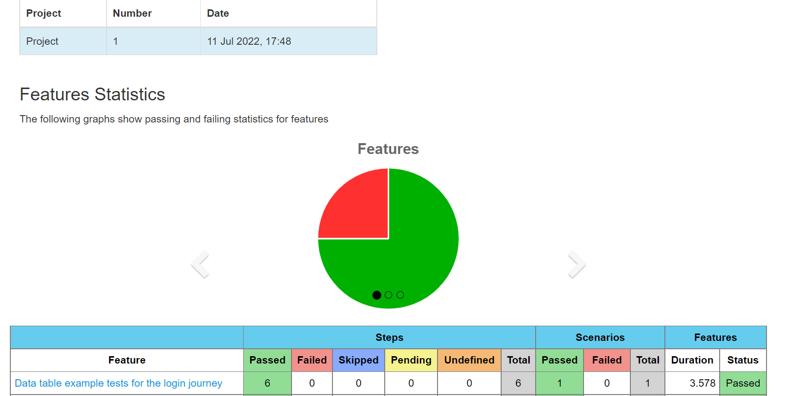
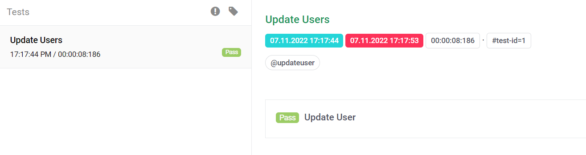
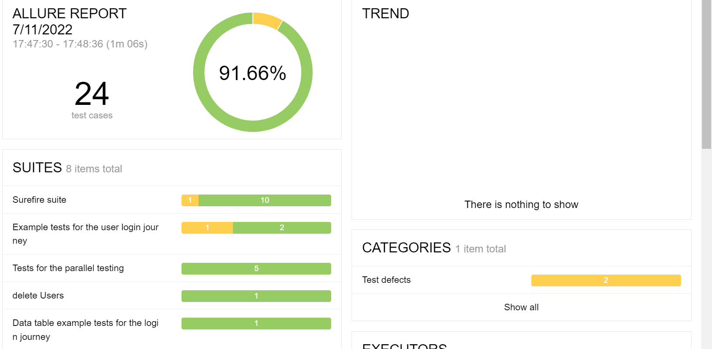

<!-- TABLE OF CONTENTS -->
<details open="open">
  <summary>Table of Contents</summary>
  <ol>
    <li>
      <a href="#about-the-project">TestX-Web-API-SeleniumRestAssured</a>
      <ul>
        <li><a href="#Accelerator-features">Accelerator features</a></li>
      </ul>
    </li>
    <li>
      <a href="#built-with">Built with</a>
    </li>
    <li>
      <a href="#getting-started">Getting Started</a>
      	<ul>
        		<li><a href="#prerequisites">Prerequisites</a></li> 
        		<li><a href="#installation">Installation</a></li>
                <li><a href="#Mandatory prerequisite ">Mandatory prerequisite for writing feature file</a></li>
        </ul>
    </li>
    <li>
    <a href="#usage">Usage</a>
        <ul>
            <li><a href="#writing-a-test">Writing a test</a></li>
            <li><a href="#testing-environment-information">Testing environment information</a></li>
            <li><a href="#api-under-test-information">API test Information</a></li>
            <li><a href="#sample-feature-file-to-understand-the-keywords"> Understanding the keywords</a></li>
            <li><a href="#key-words-used-in-cucumber-feature-files">Key Words used in Cucumber feature files</a></li>
            <li><a href="#running-tests">Running tests</a></li>
            <li><a href="#test-reports">Test reports</a>
                <ul>
                <li><a href="#default-cucumber-report">Default Cucumber report</a>
                <li><a href="#allure-reporting">Allure reporting</a>
                </ul>
            </li>
        </ul>
    </li>
    <li><a href="#faq">FAQs</a></li>
    <li><a href="#contributing">Contributing</a></li>
    <li><a href="#contact">Contact</a></li>
  </ol>
</details>

<!-- ABOUT THE PROJECT -->
### **TestX-Web-API-SeleniumRestAssured**

This accelerator is an API functional automation testing tool used to perform the functional testing of API's based on RestFull Service.

API testing is a software testing practice that tests the APIs directly — from their functionality, reliability and performance, to security. API testing effectively validates the logic of the build architecture in a short amount of time.


### **Accelerator features**
- Tests  REST  calls
- Predefined test steps
- Predefined assertions
- Soft assertion
- Generating test reports
- Jenkins pipeline integration
- Environment agnostic
- Parallel execution

### **Built with**
* **RESTAssured** - for testing the API services https://rest-assured.io/
* **Cucumber** - for BDD approach https://cucumber.io/
* **Gradle** - build management tool https://gradle.org/
* **Hamcrest** - for asserting the API responses http://hamcrest.org/JavaHamcrest/tutorial
* **Allure** - for reporting the test results https://docs.qameta.io/allure/


### **Getting Started**

Follow these instructions to get a  accelerator up and running and testing on your local machine.

### **Prerequisites**

- JDK 8 or higher version
- Gradle 6.1+
- IDE (IntelliJ or Eclipse with Cucumber Plugin)

### **Installation**

- Install Java and set path.
- Install Gradle and set path.
- Clone the repository using git.
    - git clone <url>

### **Mandatory prerequisite for writing feature file**

- Specify test environment which will choose at run time in configconstants(src/main/java/com/testx/web/api/selenium/restassured/qe/api/constants/ConfigConstants.java)
- Specify Base_Path in request.json(src/test/resources/api/api_data/qaenv/create_user/request.json) 
- Specify end point in request.json

<!-- USAGE EXAMPLES -->
### **Usage**

This accelerator is specifically designed to perform functional testing REST or SOAP API's:


1. Perform functional test for given application.
2. Provide sample test to start the the API functional testing.

### **Writing a test**

* The test case (cucumber feature file) goes in the `features` library and should have the ".feature" extension.

* You can start writing test using reference at `src/test/resources/api/features/createuser.feature`. You can extend this feature or make your own features using some of the predefined cucumber steps.

### **Project Structure:**
.
1. **SRC>MAIN>JAVA>API**:
- **constants**: In this we have a interface  where we are maintaining all the variables name

###### Example:
```
@LoadPolicy(LoadType.MERGE)
public interface ConfigConstants {

    String BASE_URI = "host_uri";
    String GZIP_SUPPORT = "gzip_support";
    String FOLLOW_REDIRECTS = "follow_redirects";
```
- **custom_exceptions:** In this  our own exceptions is present.
- **httpoperations:** In this we have Httpoperations where all required hhtp method is configured .
###### Example:
```
GET, POST, PUT, DELETE, OPTIONS, HEAD, PATCH;

    public static HttpOperations parse(String apiRequest){
        for(HttpOperations httpMethod : values()) {
            if(httpMethod.toString().equalsIgnoreCase(apiRequest))
                return httpMethod;
        }
        throw  new IllegalArgumentException();
    }

    public Response doRequest(RequestSpecification when, String url) {
        switch (this) {
            case GET: return when.get(url);
            case POST: return when.post(url);
            case PUT: return when.put(url);
            case DELETE: return when.delete(url);
            case OPTIONS: return when.options(url);
            case HEAD: return when.head(url);
            case PATCH: return when.patch(url);
        }
        throw new CustomException("The given http method: " + url + "is not valid.");
    }
```
and we have httpCertTrust and wait conditions file in this folder.
- **httpservicemanager:** In this we have RestRequestManager ,Api response matcher,config Manager,httprequestmanager,httpservice assertion,restserviceconfigmanager.

#### 2.**SRC>TEST>JAVA>API**

**a.constants:** Here we are putting entity,filepath and header class.In filepath we specify path of all files.
###### Example:
```
 public static final String API_PATH_REQUEST_JSON =
   "/api/api_data/env_type/api_path/request.json";

public static final String TEST_DATA_FILE_PATH = "api/api_data/env_type/api_path/test_data.yml";

```
**b. enums:** In this we have api context file where we specify all required enums in below format:
## eg: 
 ```
   public enum ApiContext {
     API_NAME,
     ID,
     BASE_PATH,
     REQUEST_BODY,
     RESPONSE_BODY,
     ACCESS_TOKEN,
     BRAND_HEADER,
     INITIAL_RESPONSE_BODY,
     }
```
**c. runners:** With the help of this class we are able to run our test.In this class we specify our feature file path,step def file,report plugin.

###### Examples:

 ```
@Test
@CucumberOptions
        (plugin = {"io.qameta.allure.cucumber6jvm.AllureCucumber6Jvm","pretty", "html:target/cucumber-report/report.html",
                "com.aventstack.extentreports.cucumber.adapter.ExtentCucumberAdapter:"
                ,"json:target/cucumber-report/cucumber.json","pretty","html:target/cucumber-report/cucumber-pretty",
                "json:target/cucumber-report/CucumberTestReport.json"},
                monochrome = true,
                features = "src/test/resources/api/features",
                glue = {"com.testx.web.api.selenium.restassured.qe.api.stepdefs"},
                tags = "@updateuser")

```

 **d.stepdefs:** In this folder we specify all our prebuilt steps like CommonGivenTestSteps,CommonThenTestSteps,CommonWhenTestSteps,Hooks,TestManagerContext,TestScenarioContext.

###### Example:  In this class all required given steps is present .
 ```
public class CommonGivenTestSteps {

  public RestRequestManager restRequestManager;
  TestManagerContext testManagerContext;

  public CommonGivenTestSteps(TestManagerContext context) {
  testManagerContext = context;
  restRequestManager = testManagerContext.getRestRequest();
  }

  @Given("I have API {string}")
  public void iHaveAPI(String apiName) throws IOException, URISyntaxException {
  testManagerContext.getScenarioContext().setContext(ApiContext.API_NAME, apiName);
  ApiUtilManager apiUtilManager = new ApiUtilManager();
  String basePath = apiUtilManager.getBasePath((String) testManagerContext.getScenarioContext().getContext(ApiContext.API_NAME));
  testManagerContext.getScenarioContext().setContext(ApiContext.BASE_PATH, basePath);
  apiUtilManager.setEntityHostURI(apiName, testManagerContext);
  restRequestManager.clearRequestBody();
  }

```  

**e. util:** In this folder we put our Apiutilmanager which contains configurations of env ,logger etc.

#### **4.SRC>TEST>RESOURCES:**
**a. API>api_data:**
- **devenv.jsonplaceholder**  ,in this folder we put our request.json,request_response-mapping.yml,testdata.yml.
##### request.json:

 ```
{
    "base_path": "https://reqres.in/api/users/2",
  "header": {
    "Content-Type": "application/json"
  },
  "request": {
    "name": "get single user"
  }
  }

```
#### request_response_mapping.yml:
```
 CreateUser:
  'name': 'name'

```
#### testdata.yml:
```
 User1:
  name: 'microservice_test_accelerator'

  User2:
  name: 'microservice_test_accelerator1'
```
 
- **qaenv:** Here we specify files for qa env in below format:
###### Example: We have api for create_user,so under create_user folder we put our expected_response.json,request.json,response_data_mapping.yml,response_schema.json,test_data.yml
#### expected_response.json:
```
{
  "name": "morpheus",
  "job": "leader"

}

```
#### request.json:
```
{
"host_uri": "https://reqres.in",
"base_path": "{{context_path}}/users",
"header": {
"Content-Type": "application/json"
},
"request": {
"name": "create user"
}
}
```
#### response_data_mapping.yml:
```
CreateUsers:
'name': 'morpheus'
'job': 'leader'

```

#### response_schema.json:
```
{
"$schema": "http://json-schema.org/draft-04/schema#",
"type": "object",
"properties": {
"name": {
"type": "string"
},
"job": {
"type": "string"
},
"id": {
"type": "string"
},
"createdAt": {
"type": "string"
}
},
"required": [
"name",
"job",
"id",
"createdAt"
]
}
```
#### test_data.yml:
```
user_data:
{
"name": "morpheus",
"job": "leader"
}

```

**b. API>features:** Here we put our all feature files
###### Example1:
###### Feature: delete Users

###### In this example we're deleting user.
```
Feature: delete Users

@test1
Scenario Outline: Delete User
Given I have API "<API>"
When I call method 'DELETE'
Then I get the response
Then I verify response code is 204
Examples:
| API          |
| delete_users |
```

###### Example2
###### Feature: List Users

###### In this example we're fetching list of users .
```
@apitest
Scenario Outline: Get users Status
Given I have API "<API>"
And I set content-type as JSON
When I call method 'GET'
Then I get the response
Then I verify response code is "<Status_Code>"
Examples:
| API             | Status_Code |
| get_single_user | 200         |
| get_all_users   | 201         |
| user_not_found  | 404         |

```

###### Example3:
###### Feature: Create Users

###### In this example we're creating new resource.
```
Feature: Create Users

@apitest
Scenario Outline: Create user status codes
Given I have API "<API>"
And I set content-type as JSON
And I set request body for "<RequestBody>"
When I call method 'POST'
Then I get the response
Then I verify response code is "<Status_Code>"
Examples:
| API                   | RequestBody           | Status_Code |
| create_user           | user_data             | 201         |
| create_user_success   | registerdata          | 300         |
| create_user_unsuccess | register-unsuccesfull | 400         |

@apitest
Scenario Outline: users Response comparison
Given I have API "<API>"
And I set content-type as JSON
And I set request body for "<RequestBody>"
When I call method 'POST'
And I compare the expected response with the actual response with "<COMPARISON_MODE>"

    Examples:
      | API                   | RequestBody           | COMPARISON_MODE |
      | create_user           | user_data             | LENIENT         |
      | create_user_success   | registerdata          | LENIENT         |
      | create_user_unsuccess | register-unsuccesfull | LENIENT         |


```
###### Example4:
###### Feature: Update Users

###### In this example we are updating existing resource.
```
Feature: Update Users

@apitest  @updateuser
Scenario Outline: Update User
Given I have API "<API>"
And I set content-type as JSON
And I set request body for "<RequestBody>"
When I call method 'PUT'
Then I get the response
Then I verify response code is 200
And I verify the response schema
And I verify selected elements "UpdateUserAPISelectedElementsExpectedData" in response
And I compare the expected response with the actual response with "<COMPARISON_MODE>"

    Examples:
      | API          | RequestBody | COMPARISON_MODE |
      | update_users | updateUsers | LENIENT         |

```

### **Testing environment information**

This accelerator is environment agnostic. You can provide the environment information under **src/test/resources/config/envconfig.yml** file

```
commonconfigs:
   relaxed_https: 'true'
   url_encoding_enabled: 'true'
   max_timeout: '60'
   polling_time: '5'
 
qaenv:
   host_uri: 'https://jsonplaceholder.typicode.com'
   context_path: '/comments'
   follow_redirects: 'false'
   proxy: 'http://localhost:8080/'
 
devenv:
   host_uri: 'https://jsonplaceholder.typicode.com'
   context_path: '/comments'
   follow_redirects: 'false'
   proxy: 'http://localhost:8080/'`
```

### **API test information**

As mentioned in the sample, the accelerator file will know which API to test. We just need to provide the API information.

* **src/test/resources/apischema/env_name(devenv | qaenv)/jsonplaceholder**

    * **request.json** this file contains the api information
        * ```
          {
            "base_path": "{{context_path}}", --> context_path value will be picked from src/test/resources/config/envconfig.yml file
            "header": {
              "Content-Type": "application/json"  --> Default Header Values
            },
            "request": {
              "name": "microservice_test_accelerator" --> Actual API Schema
            }
          }
          ```
        * There is host and proxy configuration in the env file and for any API you want. Hit the API with a different host or disbale the proxy for that API to make this change request.json
           ```
          {
            "host_uri": "https://xyz.com", --> This will change the host call for this  APi
            "base_path": "{{context_path}}", --> context_path value will be picked from src/test/resources/config/envconfig.yml file
            "proxy_disabled": "true", --> This will disable the proxy configuration only for this API call
            "header": {
                "Content-Type": "application/json"  --> Default Header Values
            },
            "request": {
                "name": "microservice_test_accelerator" --> Actual API Schema
            }
          }
           ```

    * **request_response_mapping.yml** this file contains request key mapping information against the response and verification of the expected matching key  and actual value in test
        * ```
          CreateUser:
            'name': 'name'
          ```
    * **testdata.yml** this file contains the test data information to run an API test (feature file)
        * ```
          User1:
            name: 'microservice_test_accelerator'
          ```

### **Key Words used in Cucumber feature files**

- Feature (A suitable name for your scenarios in the feature file)
- Given, When, Then, And, But (step keywords to describe the flow)
- Background (Common step to run for all scenarios in that feature file)
- Scenario Outline
- Examples (Using Scenario Outline and Examples, scenario can be repeated with multiple values from Examples table)
- | (Data Tables) - Data Tables can be used to pass multiple values in the same step
- @ (Tags) - Particular scenario/feature can be executed by running with tags.
- '#' can be used to provide Comments
  Cucumber Tutorials: https://docs.cucumber.io/guides/10-minute-tutorial/

### **Running tests**

There are two ways to run the test from this project

1. RunCucumberTest java file at location **src/test/java/com/testx/web/api/selenium/restassured/qe/api/runner/RunAPITest.java**
   - You can provide the test tag information in Runner file and Run the Test using Java File
   - By Default the Env name is Selected in file **src/main/java/com/microservice/test/accelerator/constants/ConfigConstants.java**
        ```
       String DEFAULT_ENV = "qaenv";
       ```

2. Using command line: Go to your project directory from terminal and execute following commands
    * mvn clean install -Dtest=RunAPITest.java
    * -Denv.type=<env_name> -Dtags=@<tag_name>` to run the specific tests on given env_name
    * -Denv.type=<env_name>` to run all the tests on given env

### **Running Parallel tests**:
1. RunCucumberTest java file at location **src/test/java/com/testx/web/api/selenium/restassured/qe/api/runner/RunAPIParallelTest.java**
  - You can provide the test tag information in Runner file and Run the Test using Java File
  - By Default the Env name is Selected in file **src/main/java/com/testx/web/api/selenium/restassured/qe/api/constants/ConfigConstants.java**
        ```
       String DEFAULT_ENV = "qaenv";
       ```

2. Using command line: Go to your project directory from terminal and execute following commands
    * mvn clean -Dtest=RunAPIParallelTest -Ddataproviderthreadcount=3 test
    * -Denv.type=<env_name> -Dtags=@<tag_name>` to run the specific tests on given env_name 
    * -Denv.type=<env_name>` to run all the tests on given env


### **Test reports**
This accelerator supports test reporting using default cucumber reports ,allure report and cucumber extent report

#### **Default Cucumber report**

For cucumber default report implementation below are the pre-requisite:
1. Add below plugin  in pom.xml
#### plugin
```
     <plugin>
        <groupId>net.masterthought</groupId>
        <artifactId>maven-cucumber-reporting</artifactId>
        <version>4.4.0</version>
        <executions>
          <execution>
            <id>execution</id>
            <phase>verify</phase>
            <goals>
              <goal>generate</goal>
            </goals>
            <configuration>
              <projectName>Project</projectName>
              <outputDirectory>${project.build.directory}</outputDirectory>
              <inputDirectory>${project.build.directory}</inputDirectory>
              <jsonFiles>
                <param>**/cucumber*.json</param>
              </jsonFiles>
            </configuration>
          </execution>
        </executions>
      </plugin>
```

2. Add below dependency in pom.xml
#### dependency
```
      <dependency>
      <groupId>net.masterthought</groupId>
      <artifactId>cucumber-reporting</artifactId>
      <version>${cucumberreporting.version}</version>
    </dependency>
```
3. In pom.xml file make testfailure=true
#### testfailure=true
```
      <testFailureIgnore>true</testFailureIgnore>
```
4. Add plugin in runner file in below format:
#### format
```
      "json:target/cucumber-report/CucumberTestReport.json"
```

5. Run below command through terminal
#### command
```
      mvn clean -Dtest=RunAPITest
     mvn clean -Dtest=RunAPIParallelTest
```
You can find the basic Cucumber report under **target/cucumber-html-reports/overview-features.html**




#### Cucumber extent Report
You can find the report after the Tests Execution
For cucumber extent report implementation below are the pre-requisite:
1. Add dependency in pom extentreports and extentreports-cucumber6-adapter.
2. Add plugin in runner file "com.aventstack.extentreports.cucumber.adapter.ExtentCucumberAdapter:"

* directory for Cucumber extent report in the current project, **target/cucumber/myextentreport.html**



#### Allure reporting
This accelerator also integrates with the Allure reporting framework. You can find the report after the Tests Execution
* directory for Allure report in the current project, **build/reports/allure-report/index.html** by default

#### We can generate allure report through terminal only by using below command:
```
      mvn allure:serve
```




### **FAQs**
**Q:** Does this Accelerator Support all HTTP status codes assertion

**A:** Yes, We can assert any HTTP status code using common step **Then I verify response code is 201**

##
**Q:** Does this Accelerator has Ability to manage test data across multiple Environment

**A:** Yes, You can manage the test data for each environments under **src/test/resources/apischema/<env_name>**

##
**Q:** Does this Accelerator Environment Agnostic

**A:** Yes, You can provide multiple environments configuration in **src/test/resources/config/envconfig.yml**

##
**Q:** Does this Accelerator Support Parallel Execution of Tests

**A:** Yes, This Accelerator supports parallel Execution of Tests, you need to provide cucumber **--thread** count in build file cucumber options
   ```
   args = ['--plugin', 'pretty', '--plugin' , 'json:target/cucumber.json', '--plugin' , 'io.qameta.allure.cucumber4jvm.AllureCucumber4Jvm' , '--glue', 'com.microservice.test.accelerator.stepdefs', 'src/test/resources/features' , --threads,'5']
   ```
##

**Q:** Does this Accelerator has In-built Test Reporting

**A:** Yes, This Accelerator Support Default Cucumber Reporting as well As Allure Reporting

##
**Q:** Does this Accelerator has ability to evaluate headers and cookies

**A:** Yes, you can evaluate any headers and cookeis of api under test and save it in testcontext for further use.

##

**Q:** Does this Accelerator supports Schema Validation

**A:** Yes, This Accelerator Support Schema Validation using JSON Schema Validation with Rest-Assured

<!-- CONTRIBUTING -->
### **Contributing**

Contributions are what make the open source community such an amazing place to be learn, inspire, and create. Any contributions you make are **greatly appreciated**.

1. Fork the Project
2. Create your Feature Branch (git checkout -b feature/AmazingFeature)
3. Commit your Changes (git commit -m 'Add some AmazingFeature')
4. ush to the Branch (git push origin feature/AmazingFeature)
5. Open a Pull Request

### Contact
Mayank Panwar (mayank.panwar@publicissapient.com)

Aanchal Chaudhary (aanchal.chaudhary@publicissapient.com)