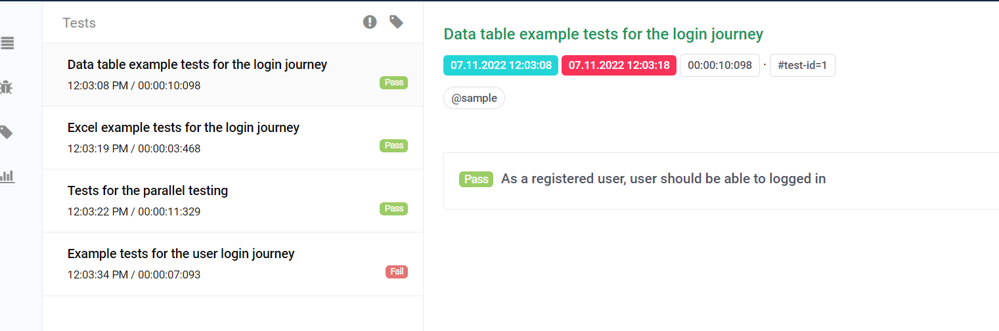
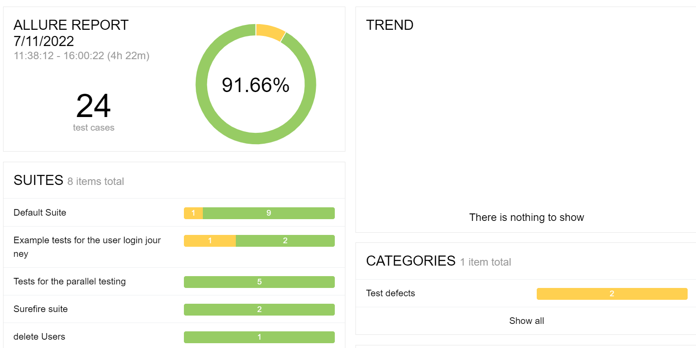

<!-- TABLE OF CONTENTS -->
<details open="open">
  <summary>Table of Contents</summary>
  <ol>
    <li>
      <a href="#ABOUT THE PROJECT">TestX-Web-API-SeleniumRestAssured</a>
      <ul>
        <li><a href="accelerator-features">Accelerator features</a></li>
      </ul>
    </li>
    <li>
      <a href="built-with">Built with</a>
    </li>
    <li>
      <a href="#getting-started">Getting Started</a>
      	<ul>
        		<li><a href="prerequisites">Prerequisites</a></li> 
        		<li><a href="installation">Installation</a></li>       
        </ul>
    </li>
    <li>
    <a href="usage">Usage</a>
        <ul>
            <li><a href="writing-a-test">Writing a test</a></li>
            <li><a href="sample-feature-file-to-understand-the-keywords"> Understanding the keywords</a></li>
            <li><a href="#key-words-used-in-cucumber-feature-files">Key Words used in Cucumber feature files</a></li>
             <li><a href="#configuration">Config Information</a></li>           
             <li><a href="#running-tests">Running tests</a></li>
            <li><a href="#test-reports">Test reports</a>
                <ul>
                <li><a href="#default-cucumber-report">Default Cucumber report</a>
                <li><a href="#extent-cucumber-report">Extent Cucumber Report</a>
                <li><a href="#allure-reporting">Allure reporting</a>
                </ul>
            </li>
        </ul>
    </li>
    <li><a href="#faq">FAQs</a></li>
    <li><a href="#contributing">Contributing</a></li>
    <li><a href="#contact">Contact</a></li>
  </ol>
</details>

<!-- ABOUT THE PROJECT -->
### **TestX-Web-API-Selenium-RestAssured**

This accelerator is an UI functional automation testing tool used to perform the UI Functional testing and API functional automation testing tool used to perform the functional testing of API's based on RestFull service.
Automated UI testing refers to the usage of specific tools or frameworks for automating the manual test processes that verify UI functionality.
### **Accelerator features:**
- Tests UI Functionality: With the help of this framework we are able to test UI functionality of web based applications.
- Common methods: In this framework we have implemented common methods concept,with the help of this method at run time it will pick up page and WebElements.
- Predefined assertions: In this file all our assertion steps is present (src/test/java/com/testx/web/api/selenium/restassured/qe/ui/stepdefinitions/prebuilt_steps)
- Prebuilt DB steps: In this file our DB connection steps is present
- Prebuilt browser steps: In this file all browser related steps present
- Generating test reports: We able to generate 2 types of report.
- Parallel execution: Parallel execution is also possible using this framework.


### **Built with**
* **Selenium** - for testing the UI https://www.selenium.dev/
* **Cucumber** - for BDD approach https://cucumber.io/
* **Maven** - build management tool https://maven.apache.org/
* **Testng** - for assertion https://testng.org/doc/
* **ExtentCucumberReport** - for reporting the test results we add dependency


### **Getting Started**

Follow these instructions to get a UI  accelerator up and running and testing on your local machine.

### **Prerequisites**

- JDK 8 or higher version
- Maven
- Cucumber plugin
- IDE (IntelliJ or Eclipse with Cucumber Plugin)

### **Installation**

- Install Java and set path.
- Install Maven and set path.
- Clone the repository using git.
    - git clone <url>


<!-- USAGE EXAMPLES -->
### **Usage**

This accelerator is specifically designed to perform functional testing for UI of web based applications and to perform functional testing REST  API's::


1. Perform functional test for given application.
2. Provide sample test to start the the UI functional testing .

### **Writing a test**

* The test case (cucumber feature file) goes in the `features` library and should have the ".feature" extension.

* You can start writing test using reference at `src/test/resources/ui/features/sample.feature`. You can extend this feature or make your own features using some of the predefined cucumber steps.

### ** Common Methods Implementation of this framework:**
1. Common methods:
  ```
public WebElement loadWebElement(String elementName, String pageClassName) {
   return loadAndFindPageElement(elementName, pageClassName);
   }

   private WebElement loadAndFindPageElement(String locatorName, String pageClassName) {
   WebElement element = null;
   Class<?> loadClass = null;
   try {
   loadClass = Class.forName(UI_PAGE_OBJECTS_PACKAGE + pageClassName);
   } catch (ClassNotFoundException e) {
   e.printStackTrace();
   }
   PageFactory.initElements(driver, loadClass);
   Field field = null;
   try {
   field = loadClass.getDeclaredField(locatorName);
   } catch (NoSuchFieldException e) {
   e.printStackTrace();
   }
   try {
   element = (WebElement) field.get(null);
   } catch (IllegalAccessException e) {
   e.printStackTrace();
   }
   return element;
   }
   }

```
### **Project Structure**:

1. #### **SRC>MAIN>JAVA>UI**
- **config**: In this  we are maintaining all the variables name 
###### Example:
```
@LoadPolicy(LoadType.MERGE)
@Config.Sources({
        "system:properties",
        "classpath:general.properties",
        "classpath:db.properties",
        "classpath:grid.properties"})
public interface Configuration extends Config {

    @Key("baseurl")
    String baseUrl();
```

here baseurl is our variable name and baseUrl() is a method which is configured in allure manager class.

- **context**: In this  driver manager object is present.

- **custom_exceptions**: In this  our own exceptions is present.
- **reporter**: In this our allure manager is present where we put all our methods which we mention in config class.
- **webdriver**: In this we maintain our drivermanager ,driver manager utils,selectwebdriver factory and webdriver factory class.

 2. #### **SRC>MAIN>RESOURCES:**
- **config.properties**:Here we mention our baseurl,browsername in below format.
###### Example:
   ```
 baseurl=https://www.saucedemo.com/
 browsername=chrome
 isheadless=false
```
- **general.properties:Here we specify below details.**
###### Example:

   ```
target = local
url.base = https://www.saucedemo.com/
timeout = 3
faker.locale = pt-BR
browser = chrome
headless = true
```

#### 3.SRC>TEST>JAVA>UI
a. **pageobjects**-Here we are putting all page class.

###### Example: SamplePage ,here we are putting our xpath for datepicker element which can be picked at run time using common methods.
     
```
public class SamplePage extends AbstractPageObject {

    protected SamplePage(TestContext testContext) {
        super(testContext);
    }

    @FindBy(id = "datePickerMonthYearInput")
    public static WebElement datePickerInput;
}

```
b. **stepdefinations**:In this folder we specify all our prebuilt steps like BaseSetup,Hooks,LoginSteps
###### Example:  In this class all required login steps is present.
```
public class SamplePage extends AbstractPageObject {

    protected SamplePage(TestContext testContext) {
        super(testContext);
    }

    @FindBy(id = "datePickerMonthYearInput")
    public static WebElement datePickerInput;
}

```

c. **testrunners**: With the help of this class we are able to run our test.In this class we specify our feature file path,step def file,report plugin.
```
@Test
@CucumberOptions
        (plugin = {"io.qameta.allure.cucumber6jvm.AllureCucumber6Jvm","pretty", "html:target/cucumber-report/report.html",
                "com.aventstack.extentreports.cucumber.adapter.ExtentCucumberAdapter:"
                ,"json:target/cucumber-report/cucumber.json","pretty","html:target/cucumber-report/cucumber-pretty",
                "json:target/cucumber-report/CucumberTestReport.json"},
                monochrome = true,
                features = "src/test/resources/ui/features",
                glue = {"com.testx.web.api.selenium.restassured.qe.ui.stepdefinitions"},
                tags = "@sample")

```

#### 4. ****SRC>TEST>RESOURCES****

**a. UI>excel_data:** In excel_data we put our TestData file ,in this file we put our reusable data and fetch this data from feature file.
**b. UI>features:** Here we put our all feature files
###### Example1:
###### Feature: Data table example tests for the login journey

###### In this example we're validating user login functionality with valid credential and fetching data from database table.

```
@sample
Feature: Data table example tests for the login journey

  Scenario: As a registered user, user should be able to logged in
    Given I am in App main site
    And I enter the data for the following fields on the "LoginPage"
      | fieldName     | data          |
      | usernameInput | standard_user |
      | passwordInput | secret_sauce  |
    When I click the following elements on the "LoginPage"
      | fieldName   |
      | loginButton |
    And I verify the text of the following fields on the "HomePage"
      | fieldName    | fieldText |
      | productsMain | PRODUCTS  |

    Then I verify that the text: "Swag" partially matches the current page title
    And I verify that the text: "Swag Labs" exactly matches the current page title
```
###### **Example2**
###### **Feature: Excel example tests for the login journey**

###### **In this example we're validating user login functionality with valid credential and fetching data from testdata .**

```
@sample
Feature: Excel example tests for the login journey

  Scenario: Login to the application using excel data
    Given I am in App main site
    When I enter the data for the following fields from the excel file TestData:LoginPage:TID1
      | FieldName     | PageName  |
      | usernameInput | LoginPage |
      | passwordInput | LoginPage |
    When I click the "loginButton" on the "LoginPage"
    And I verify that the text: "Swag Labs" exactly matches the current page title

```
###### Example3:
###### Feature: Tests for the parallel testing

###### In this example we're running parallel test.

```
@sample
Feature: Tests for the parallel testing

  Scenario: Parallel test 1
    Given I am in App main site
    And I enter the value "standard_user" into the "usernameInput" on the "LoginPage"
    And I enter the value "secret_sauce" into the "passwordInput" on the "LoginPage"
    When I click the "loginButton" on the "LoginPage"
    And I verify that the text: "Swag Labs" exactly matches the current page title

  Scenario: Parallel test 2
    Given I am in App main site
    And I enter the value "standard_user" into the "usernameInput" on the "LoginPage"
    And I enter the value "secret_sauce" into the "passwordInput" on the "LoginPage"
    When I click the "loginButton" on the "LoginPage"
    And I verify that the text: "Swag Labs" exactly matches the current page title

```
###### Example4:
###### Feature: Example tests for the user login journey

###### This is the generic way of writing feature file .
```
@sample
Feature: Example tests for the user login journey

  Scenario: As a registered user, user should be able to logged in
    Given I am in App main site
    And I enter the value "standard_user" into the "usernameInput" on the "LoginPage"
    And I enter the value "secret_sauce" into the "passwordInput" on the "LoginPage"
    When I click the "loginButton" on the "LoginPage"
    And I verify that the text: "Swag Labs" exactly matches the current page title
```

#### Key Words used in Cucumber feature files

- Feature (A suitable name for your scenarios in the feature file)
- Scenario (A suitable name for the scenario you are trying to write)
- Given, When, Then, And, But (step keywords to describe the flow)
.- Examples (Using Scenario and Examples, scenario can be repeated with multiple values from Examples table)
- | (Data Tables) - Data Tables can be used to pass multiple values in the same step
- @ (Tags) - Particular scenario/feature can be executed by running with tags.
- '#' can be used to provide Comments
  Cucumber Tutorials: https://docs.cucumber.io/guides/10-minute-tutorial/

### Running tests :

There are two ways to run the test from this project

1. RunCucumberTest java file at location **src/test/java/com/testx/web/api/selenium/restassured/qe/ui/testrunners/RunUITest.java**
    1. You can provide the test tag information in Runner file and Run the Test using Java File


2. Using command line: Go to your project directory from terminal and execute following commands
    * mvn clean install -Dtest=RunUITest.java

### Running Parallel tests :
1. RunCucumberTest java file at location **src/test/java/com/testx/web/api/selenium/restassured/qe/ui/testrunners/RunUIParallelTest.java**
    1. You can provide the test tag information in Runner file and Run the Test using Java File


2. Using command line: Go to your project directory from terminal and execute following commands
    * mvn clean -Dtest=RunUIParallelTest -Ddataproviderthreadcount=3 test


### Test reports
This accelerator supports test reporting using default cucumber reports ,allure report and cucumber extent report

### Default Cucumber report

For cucumber default report implementation below are the pre-requisite:
1. Add below plugin  in pom.xml 
#### plugin
```
<plugin>
        <groupId>net.masterthought</groupId>
        <artifactId>maven-cucumber-reporting</artifactId>
        <version>4.4.0</version>
        <executions>
          <execution>
            <id>execution</id>
            <phase>verify</phase>
            <goals>
              <goal>generate</goal>
            </goals>
            <configuration>
              <projectName>Project</projectName>
              <outputDirectory>${project.build.directory}</outputDirectory>
              <inputDirectory>${project.build.directory}</inputDirectory>
              <jsonFiles>
                <param>**/cucumber*.json</param>
              </jsonFiles>
            </configuration>
          </execution>
        </executions>
      </plugin>
```
     
2. Add below dependency in pom.xml 
#### dependency
```
 <dependency>
      <groupId>net.masterthought</groupId>
      <artifactId>cucumber-reporting</artifactId>
      <version>${cucumberreporting.version}</version>
    </dependency>
```
    
3. In pom.xml file make testfailure=true
#### testfailure=true
```
 <testFailureIgnore>true</testFailureIgnore>
```
   
4. Add plugin in runner file in below format:
#### format
```
 "json:target/cucumber-report/CucumberTestReport.json"
```
 
5. Run below command through terminal
#### command
```
   mvn clean -Dtest=RunUITest
     mvn clean -Dtest=RunUIParallelTest
```
  
You can find the basic Cucumber report under **target/cucumber-html-reports/overview-features.html**

```
   mvn clean -Dtest=RunUITest
     mvn clean -Dtest=RunUIParallelTest
```


#### Cucumber extent Report
You can find the report after the Tests Execution
For cucumber extent report implementation below are the pre-requisite:
1. Add dependency in pom extentreports and extentreports-cucumber6-adapter.
2. Add plugin in runner file "com.aventstack.extentreports.cucumber.adapter.ExtentCucumberAdapter:"

* directory for Cucumber extent report in the current project, **target/cucumber/myextentreport.html**



#### Allure reporting
This accelerator also integrates with the Allure reporting framework. You can find the report after the Tests Execution
* directory for Allure report in the current project, **build/reports/allure-report/index.html** by default

#### We can generate allure report through terminal only by using below command:
```
    mvn allure:serve
```




### FAQs
**Q:** Does this Accelerator Support all ParallelUI run

**A:** Yes, We can run test in parallel**

##
**Q:** Does this Accelerator has Ability to pick elements and pages dynamically at run time.
**A:** Yes, this Accelerator has Ability to pick elements and pages dynamically at run time**

##

**Q:** Does this Accelerator has In-built Test Reporting

**A:** Yes, This Accelerator Support Default Cucumber Reporting as well As Cucumber Extent Report.

##

<!-- CONTRIBUTING -->
### Contributing

Contributions are what make the open source community such an amazing place to be learn, inspire, and create. Any contributions you make are **greatly appreciated**.

1. Fork the Project
2. Create your Feature Branch (git checkout -b feature/AmazingFeature)
3. Commit your Changes (git commit -m 'Add some AmazingFeature')
4. ush to the Branch (git push origin feature/AmazingFeature)
5. Open a Pull Request

### Contact
Mayank Panwar (mayank.panwar@publicissapient.com)

Aanchal Chaudhary (aanchal.chaudhary@publicissapient.com)


